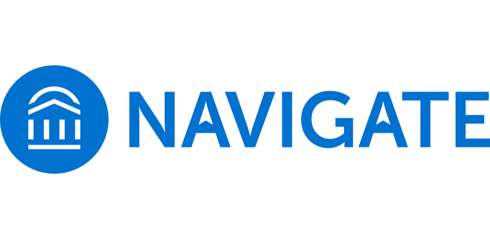

# API


# Инструкция по запуску:
### 1. Установить зависимости ```npm i```.
### 2. Выполнить миграцию ```npx sequelize-cli db:migrate```.
### 3. Собрать приложение ```npm run build```.
### 4. Запустить приложение ```npm start```.

# Дополнительно:
### 5. Запустить приложение в режиме отладки ```npm run watch```.
### 6. Отменить миграцию ```npx sequelize-cli db:migrate:undo```.
